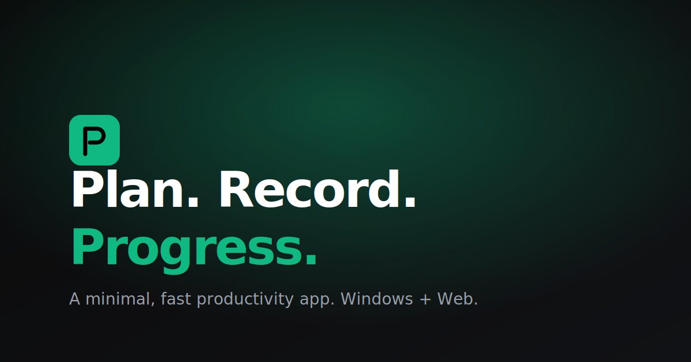

# PRP — Landing Page

A minimal, fast, fully-responsive landing page for **PRP** — a productivity app.
Built with plain **HTML / CSS / JavaScript** (no framework, no build step) so it loads
in a blink and deploys anywhere.



## Highlights

- **Minimal, modern design** with a green accent on a black & white base
- **Light & Dark mode** with a one-click toggle (respects OS preference, persisted)
- **Bilingual: English + Arabic** with full **RTL** support and a language toggle
- Fully **responsive** (mobile, tablet, desktop)
- **SEO + Open Graph** meta tags, sitemap, robots.txt
- Smooth scroll, subtle reveal animations, screenshot carousel
- **Zero dependencies** — one `index.html`, one `styles.css`, one `script.js`
- One-click deploy to **Vercel** or **Netlify**

## Sections

1. **Hero** — app name, value proposition, two CTAs (Download / Open Web App)
2. **Screenshots** — carousel of app screenshots (SVG placeholders included)
3. **Features** — six core features with icons
4. **Availability** — Windows & Web active, Android / iOS / macOS marked *Coming Soon*
5. **Footer** — GitHub link, contact, privacy, terms

## Project Structure

```
prp_app_landing_page/
├── index.html              # Single-page markup
├── styles.css              # Theming, layout, RTL, responsive
├── script.js               # Theme toggle, i18n (EN/AR), carousel
├── assets/
│   ├── favicon.svg
│   ├── og-image.svg
│   └── screenshots/
│       ├── screen-1.svg
│       ├── screen-2.svg
│       └── screen-3.svg
├── package.json            # Optional — local dev server script
├── vercel.json             # Vercel deploy config (caching + headers)
├── netlify.toml            # Netlify deploy config
├── robots.txt
├── sitemap.xml
└── README.md
```

## Run Locally

No build step needed. Pick any of these:

### Option 1 — npm (zero-install serve)
```bash
npm run dev
# opens a static server on http://localhost:3000
```

### Option 2 — Python
```bash
python3 -m http.server 3000
```

### Option 3 — VS Code Live Server
Right-click `index.html` → **Open with Live Server**.

## Deploy

### Vercel
```bash
npm i -g vercel
vercel
```
Or connect the GitHub repo at <https://vercel.com/new> — zero config needed,
`vercel.json` is already set up.

### Netlify
```bash
npm i -g netlify-cli
netlify deploy --prod
```
Or drag-and-drop the project folder at <https://app.netlify.com/drop>, or connect
the repo at <https://app.netlify.com/start>. `netlify.toml` is included.

### GitHub Pages
Push to `main`, then in **Settings → Pages** choose "Deploy from a branch" → `main` → `/ (root)`.

## Customization

| What                | Where                                                                 |
| ------------------- | --------------------------------------------------------------------- |
| App name / tagline  | `index.html` (brand + hero) and `script.js` (`translations`)          |
| Accent color        | `styles.css` → `:root { --accent: #10b981 }`                          |
| Screenshots         | Replace files in `assets/screenshots/` (keep names or update markup)  |
| Download links      | `index.html` — hero CTAs and `.platform` anchors                      |
| Languages           | Add a new locale to `translations` in `script.js`                     |
| SEO / Open Graph    | `<head>` of `index.html`                                              |

## Browser Support

Modern evergreen browsers (Chrome, Edge, Firefox, Safari). Uses `backdrop-filter`,
`color-mix`, and `IntersectionObserver` — all widely supported. Gracefully degrades
where unavailable.

## License

MIT — do whatever you want, attribution appreciated.
